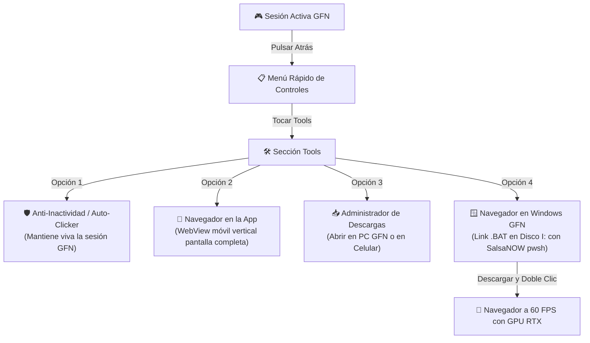

<p align="center">
  
</p>

<h1 align="center">new OpenNow</h1>

<p align="center">
  <b>Cliente Nativo de GeForce NOW para Android con Herramientas de Instancia Windows, Navegador Remoto por GPU y Administrador de Descargas.</b>
</p>

<p align="center">
  <a href="https://github.com/anhot11/nOpenNow/releases/latest"></a>
  <a href="https://github.com/anhot11/nOpenNow/actions"></a>
  <a href="https://github.com/anhot11/nOpenNow/releases"></a>
</p>

---

## 🌟 ¿Qué es new OpenNow?

`new OpenNow` evoluciona el concepto de navegación y juego en la nube. En lugar de depender de una VPS Linux lenta o costosa (como en VPS Browser), **new OpenNow** aprovecha la potencia de las instancias virtuales de **Windows en NVIDIA GeForce NOW**:

- 🎮 **Streaming de Ultrabaja Latencia:** Decodificación acelerada por hardware con `MediaCodec` (WebRTC) y transporte nativo **NVST** en Rust (RTSP/SRTP con FEC/NACK).
- 🖥️ **Instancia de Windows con GPUs RTX:** Ejecución de juegos y aplicaciones de escritorio de Windows en servidores de alta gama.
- 🦊 **Menú Rápido "Tools":** Durante una sesión en streaming, al presionar el botón "Atrás" en tu teléfono, accedes inmediatamente a la sección **Tools** en primer lugar.
- 🛡️ **Anti-AFK / Auto-Clicker Inteligente:** Envía micro-señales automáticas periódicas (30s, 45s, 60s, 120s) sin mover el cursor (modo Silencioso) o simulando toques (modo Clic) para evitar que GeForce NOW desconecte la sesión por inactividad.
- 📱 **Navegador Móvil Integrado (In-App Browser):** Abre un navegador web vertical a pantalla completa con botón 'X' de cierre rápido y controles táctiles ocultos automáticamente para máxima inmersión.
- 📥 **Administrador de Descargas Integrado:** Interfaz dual con gestor de descargas para abrir archivos directamente en Windows GFN (`🚀 Abrir en PC`) o en el móvil (`📱 Celular`).
- 📉 **Modo Ahorro en Navegador (2 Mbps):** Al abrir el navegador dentro del juego, reduce el bitrate de GeForce NOW automáticamente a 2 Mbps, ahorrando hasta un 90% de datos y batería mientras mantienes viva tu sesión. Al cerrarlo, restaura la calidad de juego al instante.
- 🩺 **Diagnóstico y Reportes directos a GitHub Issues:** Integrado con [GitHub Issues de new OpenNow](https://github.com/anhot11/nOpenNow/issues). Recopila telemetría de red, stream y dispositivo, y crea el issue preformateado en Markdown con 1 solo toque (disponible en español y sin restricciones de idioma del sistema).
- ⚡ **Lanzador .BAT Híbrido para Windows GFN (Disco `I:\`):** Archivo descargable de un solo doble clic (`nOpenNow-Browser.bat`) que utiliza automáticamente PowerShell 7 de SalsaNOW (`I:\Apps\SalsaNOW SilentApps\Powershell\pwsh.exe`), crea el perfil en `I:\nOpenNow_Browser` e inicia el navegador a 60 FPS con aceleración de GPU RTX.

---

## 📱 Experiencia en la App Android



1. **Estando en la transmisión**, pulsa el botón **Atrás** de tu celular para abrir el menú rápido.
2. En la barra de herramientas del panel rápido, pulsa en **Tools** (ubicado al inicio del menú).
3. Dispones de utilidades integradas:
   - **Anti-Inactividad / Auto-Clicker**: Activa la protección Anti-AFK y personaliza el intervalo y modo (Silencioso o Clic).
   - **Navegador en la App**: Despliega el navegador web superpuesto vertical en pantalla completa sin salir del juego.
   - **Administrador de Descargas**: Pestaña dedicada con enlaces rápidos y botón "🚀 Abrir en PC" para ejecutar programas descargados directamente en la instancia de Windows.
   - **Lanzador Windows GFN (.BAT)**: Descarga directa del archivo `.bat` ejecutable:
     ```
     https://github.com/anhot11/nOpenNow/releases/latest/download/nOpenNow-Browser.bat
     ```
     o comando SalsaNOW PowerShell 7:
     ```powershell
     "I:\Apps\SalsaNOW SilentApps\Powershell\pwsh.exe" -c "irm https://raw.githubusercontent.com/anhot11/nOpenNow/main/tools/windows/browser.ps1 | iex"
     ```

---

## 🗂️ Estructura del Repositorio

- **`android/`**: Código fuente del cliente nativo Android (Kotlin, Jetpack Compose, C++ JNI y NVST Rust).
- **`tools/windows/`**: Scripts de automatización para la instancia de Windows (`browser.ps1`, `nOpenNow-Browser.bat`).
- **`.github/workflows/`**: Pipeline de CI/CD para compilar APKs Release y Debug en GitHub Actions.
- **`docs/`**: Documentación y recursos gráficos (`docs/icon.png`).

---

## 🤖 Compilación y Descargas Oficiales

> [!IMPORTANT]
> Para no saturar la CPU ni agotar la memoria RAM de dispositivos móviles, **la compilación de la APK se realiza 100% en la nube mediante GitHub Actions**, produciendo binarios de Release firmados y listos para instalar.

- 📥 **[Descargas en GitHub Releases (Última Versión)](https://github.com/anhot11/nOpenNow/releases/latest)**:
  - 🚀 **[app-release.apk (Firmado y Optimizado)](https://github.com/anhot11/nOpenNow/releases/latest/download/app-release.apk)**
  - 🧪 **[app-debug.apk](https://github.com/anhot11/nOpenNow/releases/latest/download/app-debug.apk)**
  - 🖥️ **[nOpenNow-Browser.bat](https://github.com/anhot11/nOpenNow/releases/latest/download/nOpenNow-Browser.bat)**
