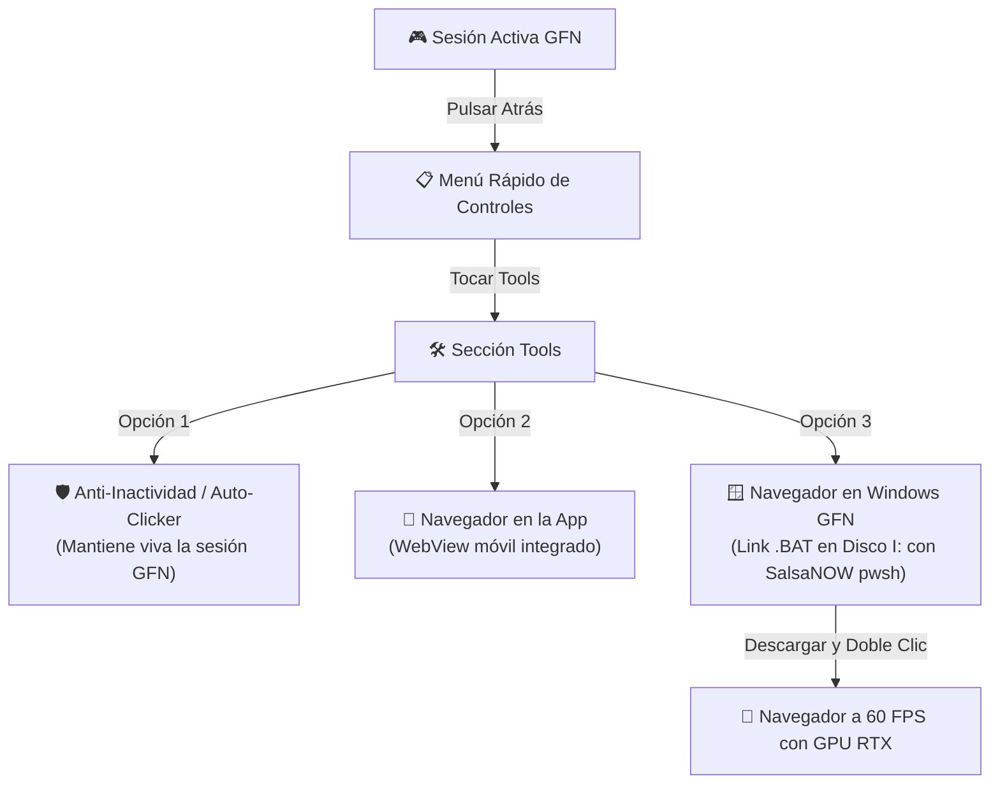

# 🚀 nOpenNow

**Cliente Nativo de GeForce NOW para Android con Herramientas de Instancia Windows y Navegador Remoto por GPU.**

---

## 🌟 ¿Qué es nOpenNow?

`nOpenNow` evoluciona el concepto de navegación y juego en la nube. En lugar de depender de una VPS Linux lenta o costosa (como en VPS Browser), **nOpenNow** aprovecha la potencia de las instancias virtuales de **Windows en NVIDIA GeForce NOW**:

- 🎮 **Streaming de Ultrabaja Latencia:** Decodificación acelerada por hardware con `MediaCodec` (WebRTC) y transporte nativo **NVST** en Rust (RTSP/SRTP con FEC/NACK).
- 🖥️ **Instancia de Windows con GPUs RTX:** Ejecución de juegos y aplicaciones de escritorio de Windows en servidores de alta gama.
- 🦊 **Menú Rápido "Tools":** Durante una sesión en streaming, al presionar el botón "Atrás" en tu teléfono, accedes a la sección **Tools**.
- 🛡️ **Anti-AFK / Auto-Clicker Inteligente:** Envía micro-señales automáticas periódicas (30s, 45s, 60s, 120s) sin mover el cursor (modo Silencioso) o simulando toques (modo Clic) para evitar que GeForce NOW desconecte la sesión por inactividad.
- 📱 **Navegador Integrado en la App (In-App Browser):** Abre un navegador web móvil completo (con navegación, recarga y barra de URL) directamente sobre el stream sin salir de la app ni del juego.
- 📉 **Modo Ahorro en Navegador (2 Mbps):** Al abrir el navegador dentro del juego, reduce el bitrate de GeForce NOW automáticamente a 2 Mbps, ahorrando hasta un 90% de datos y batería mientras mantienes viva tu sesión. Al cerrarlo, restaura la calidad de juego al instante.
- 🩺 **Diagnóstico y Reportes directos a GitHub Issues:** Integrado con [GitHub Issues de nOpenNow](https://github.com/anhot11/nOpenNow/issues). Recopila telemetría de red, stream y dispositivo, y crea el issue preformateado en Markdown con 1 solo toque (disponible en español y sin restricciones de idioma del sistema).
- ⚡ **Lanzador .BAT Híbrido para Windows GFN (Disco `I:\`):** Archivo descargable de un solo doble clic (`nOpenNow-Browser.bat`) que utiliza automáticamente PowerShell 7 de SalsaNOW (`I:\Apps\SalsaNOW SilentApps\Powershell\pwsh.exe`), crea el perfil en `I:\nOpenNow_Browser` e inicia el navegador a 60 FPS con aceleración de GPU RTX.

---

## 📱 Experiencia en la App Android



1. **Estando en la transmisión**, pulsa el botón **Atrás** de tu celular para abrir el menú rápido.
2. En la barra de herramientas del panel rápido, pulsa en **Tools**.
3. Dispones de 3 potentes utilidades:
   - **Anti-Inactividad / Auto-Clicker**: Activa la protección Anti-AFK y personaliza el intervalo y modo (Silencioso o Clic). Verás un badge visual verde en pantalla indicando que la sesión está protegida.
   - **Navegador en la App**: Toca "Abrir" para desplegar el navegador web superpuesto sin salir de tu juego.
   - **Lanzador Windows GFN (.BAT)**: Copia el enlace directo al archivo `.bat`:
     ```
     https://raw.githubusercontent.com/anhot11/nOpenNow/main/tools/windows/nOpenNow-Browser.bat
     ```
     o copia el comando de SalsaNOW PowerShell 7:
     ```powershell
     "I:\Apps\SalsaNOW SilentApps\Powershell\pwsh.exe" -c "irm https://raw.githubusercontent.com/anhot11/nOpenNow/main/tools/windows/browser.ps1 | iex"
     ```
4. Al hacer doble clic en Windows GFN, se configuran las carpetas en `I:\nOpenNow_Browser` y se lanza el navegador instantáneamente a 60 FPS.

---

## 🗂️ Estructura del Repositorio

- **`android/`**: Código fuente del cliente nativo Android (Kotlin, Jetpack Compose, C++ JNI y NVST Rust).
- **`tools/windows/`**: Scripts de automatización para la instancia de Windows (`browser.ps1`, `launch-browser.bat`).
- **`.github/workflows/`**: Pipeline de CI/CD para compilar la APK en GitHub Actions (sin sobrecargar el procesador ni la memoria de teléfonos móviles).

---

## 🤖 Compilación y Distribución

> [!IMPORTANT]
> Para no saturar la CPU ni agotar la memoria RAM de dispositivos móviles, **la compilación de la APK se realiza 100% en la nube mediante GitHub Actions**.

- 📥 **Descarga el APK Oficial**: [**nOpenNow v1.1.0 Release**](https://github.com/anhot11/nOpenNow/releases/tag/v1.1.0)
- ⚙️ **Actualizaciones Automáticas**: La aplicación incluye actualizador automático integrado conectado con los releases de GitHub.
