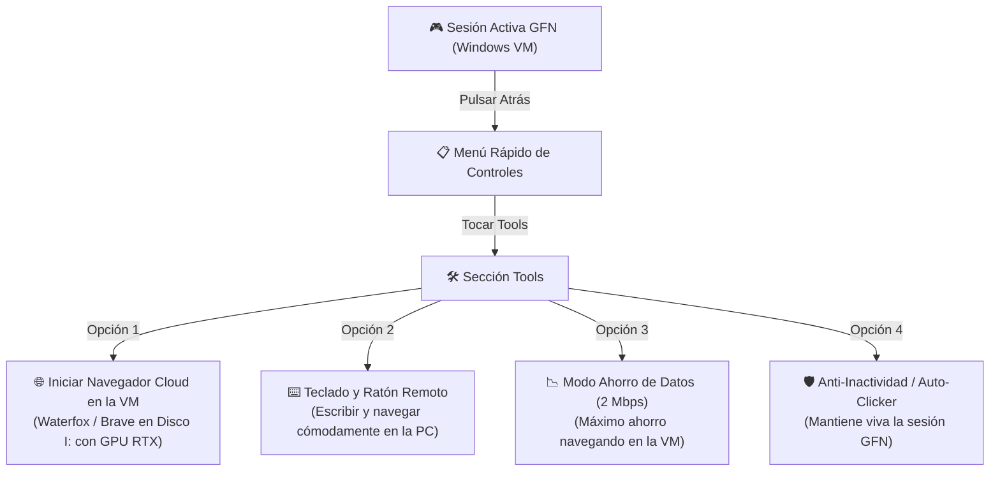

<p align="center">
  
</p>

<h1 align="center">new OpenNow</h1>

<p align="center">
  <b>Cliente Nativo de GeForce NOW para Android con Herramientas de Instancia Windows, Navegador Remoto por GPU y Administrador de Descargas.</b>
</p>

<p align="center">
  <a href="https://github.com/anhot11/nOpenNow/releases/latest"></a>
  <a href="https://github.com/anhot11/nOpenNow/actions"></a>
  <a href="https://github.com/anhot11/nOpenNow/releases"></a>
</p>

---

## 🌟 ¿Qué es new OpenNow?

`new OpenNow` evoluciona el concepto de navegación y juego en la nube. En lugar de depender de una VPS Linux lenta o costosa (como en VPS Browser), **new OpenNow** aprovecha la potencia de las instancias virtuales de **Windows en NVIDIA GeForce NOW**:

- 🎮 **Streaming de Ultrabaja Latencia:** Decodificación acelerada por hardware con `MediaCodec` (WebRTC) y transporte nativo **NVST** en Rust (RTSP/SRTP con FEC/NACK).
- 🖥️ **Instancia de Windows con GPUs RTX:** Ejecución de juegos y aplicaciones de escritorio de Windows en servidores de alta gama.
- 🦊 **Menú Rápido "Tools":** Durante una sesión en streaming, al presionar el botón "Atrás" en tu teléfono, accedes inmediatamente a la sección **Tools** en primer lugar.
- 🛡️ **Anti-AFK / Auto-Clicker Inteligente:** Envía micro-señales automáticas periódicas (30s, 45s, 60s, 120s) sin mover el cursor (modo Silencioso) o simulando toques (modo Clic) para evitar que GeForce NOW desconecte la sesión por inactividad.
- 🌐 **Navegador Cloud 100% en la VM (GeForce NOW):** El navegador (Waterfox de SalsaNOW o Brave Portable) se ejecuta en la máquina virtual en la nube (Disco `I:\`). Todo el tráfico web, descargas y privacidad permanecen en el datacenter de GeForce NOW, protegiendo tu identidad y aprovechando la velocidad gigabit.
- 📉 **Modo Ahorro en Navegación (2 Mbps):** Al navegar en la VM, reduce el bitrate de GeForce NOW automáticamente a 2 Mbps, ahorrando hasta un 90% de datos y batería mientras mantienes viva tu sesión.
- ⌨️ **Control Remoto desde la App:** Inicia el navegador en la PC con 1 toque, abre el teclado virtual para escribir en Windows, controla el puntero con Ratón Táctil y envía URLs directas a la máquina virtual.
- 🩺 **Diagnóstico y Reportes directos a GitHub Issues:** Integrado con [GitHub Issues de new OpenNow](https://github.com/anhot11/nOpenNow/issues). Recopila telemetría de red, stream y dispositivo, y crea el issue preformateado en Markdown con 1 solo toque.
- ⚡ **Lanzador .BAT para Windows GFN (Disco `I:\`):** Archivo descargable (`nOpenNow-Browser.bat`) que elimina y bloquea activamente Microsoft Edge, utiliza PowerShell 7 de SalsaNOW, crea el perfil en `I:\nOpenNow_Browser` e inicia el navegador con aceleración de GPU RTX.

---

## 📱 Experiencia en la App Android



1. **Estando en la transmisión**, pulsa el botón **Atrás** de tu celular para abrir el menú rápido.
2. En la barra de herramientas del panel rápido, pulsa en **Tools** (ubicado al inicio del menú).
3. Dispones de utilidades integradas para controlar la máquina virtual:
   - **Iniciar Navegador en la VM**: Envía la señal para abrir Waterfox o Brave en Disco `I:\` inmediatamente.
   - **Teclado Remoto**: Escribe en las barras de búsqueda y formularios del navegador de Windows.
   - **Ahorro de Datos (2 Mbps)**: Reduce el consumo de datos de la transmisión a 2 Mbps mientras navegas.
   - **Anti-Inactividad / Auto-Clicker**: Activa la protección Anti-AFK con intervalo personalizado.
   - **Lanzador Windows GFN (.BAT)**: Enlace de descarga directa del script:
     ```
     https://github.com/anhot11/nOpenNow/releases/latest/download/nOpenNow-Browser.bat
     ```
     o comando SalsaNOW PowerShell 7:
     ```powershell
     "I:\Apps\SalsaNOW SilentApps\Powershell\pwsh.exe" -c "irm https://raw.githubusercontent.com/anhot11/nOpenNow/main/tools/windows/browser.ps1 | iex"
     ```

---

## 🗂️ Estructura del Repositorio

- **`android/`**: Código fuente del cliente nativo Android (Kotlin, Jetpack Compose, C++ JNI y NVST Rust).
- **`tools/windows/`**: Scripts de automatización para la instancia de Windows (`browser.ps1`, `nOpenNow-Browser.bat`).
- **`.github/workflows/`**: Pipeline de CI/CD para compilar APKs Release y Debug en GitHub Actions.
- **`docs/`**: Documentación y recursos gráficos (`docs/icon.png`).

---

## 🤖 Compilación y Descargas Oficiales

> [!IMPORTANT]
> Para no saturar la CPU ni agotar la memoria RAM de dispositivos móviles, **la compilación de la APK se realiza 100% en la nube mediante GitHub Actions**, produciendo binarios de Release firmados y listos para instalar.

- 📥 **[Descargas en GitHub Releases (Última Versión)](https://github.com/anhot11/nOpenNow/releases/latest)**:
  - 🚀 **[app-release.apk (Firmado y Optimizado)](https://github.com/anhot11/nOpenNow/releases/latest/download/app-release.apk)**
  - 🧪 **[app-debug.apk](https://github.com/anhot11/nOpenNow/releases/latest/download/app-debug.apk)**
  - 🖥️ **[nOpenNow-Browser.bat](https://github.com/anhot11/nOpenNow/releases/latest/download/nOpenNow-Browser.bat)**
