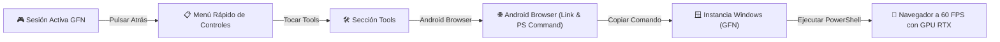

# 🚀 nOpenNow

**Cliente Nativo de GeForce NOW para Android con Herramientas de Instancia Windows y Navegador Remoto por GPU.**

---

## 🌟 ¿Qué es nOpenNow?

`nOpenNow` evoluciona el concepto de navegación y juego en la nube. En lugar de depender de una VPS Linux lenta o costosa (como en VPS Browser), **nOpenNow** aprovecha la potencia de las instancias virtuales de **Windows en NVIDIA GeForce NOW**:

- 🎮 **Streaming de Ultrabaja Latencia:** Decodificación acelerada por hardware con `MediaCodec` (WebRTC) y transporte nativo **NVST** en Rust (RTSP/SRTP con FEC/NACK).
- 🖥️ **Instancia de Windows con GPUs RTX:** Ejecución de juegos y aplicaciones de escritorio de Windows en servidores de alta gama.
- 🦊 **Menú Rápido "Tools" & "Android Browser":** Durante una sesión en streaming, al presionar el botón "Atrás" en tu teléfono, accedes a la sección **Tools > Android Browser**.
- ⚡ **Lanzamiento Remoto en Windows:** Copia un comando PowerShell corto de una línea o enlace directo para ejecutarlo dentro de la sesión de Windows en GFN, iniciando un navegador optimizado a pantalla completa a 60 FPS.

---

## 📱 Experiencia en la App Android



1. **Estando en la transmisión**, pulsa el botón **Atrás** de tu celular.
2. En la barra de herramientas del panel rápido, pulsa en **Tools**.
3. Selecciona **Android Browser**.
4. Verás el comando PowerShell y el enlace directo con un botón para **Copiar al portapapeles**:
   ```powershell
   irm https://raw.githubusercontent.com/anhot11/nOpenNow/main/tools/windows/browser.ps1 | iex
   ```
5. En la máquina virtual de Windows (usando el navegador de Steam `Shift+Tab`, la ayuda de Steam o la terminal), pega y ejecuta el comando.
6. ¡Listo! El navegador se iniciará maximizado en Windows, aprovechando la GPU RTX de NVIDIA y transmitiéndose directamente a tu teléfono.

---

## 🗂️ Estructura del Repositorio

- **`android/`**: Código fuente del cliente nativo Android (Kotlin, Jetpack Compose, C++ JNI y NVST Rust).
- **`tools/windows/`**: Scripts de automatización para la instancia de Windows (`browser.ps1`, `launch-browser.bat`).
- **`.github/workflows/`**: Pipeline de CI/CD para compilar la APK en GitHub Actions (sin sobrecargar el procesador ni la memoria de teléfonos móviles).

---

## 🤖 Compilación y Distribución

> [!IMPORTANT]
> Para no saturar la CPU ni agotar la memoria RAM de dispositivos móviles, **la compilación de la APK se realiza 100% en la nube mediante GitHub Actions**.

Al realizar un push o crear un tag (`v*`), el workflow compila automáticamente la aplicación y genera la APK lista para instalar.
